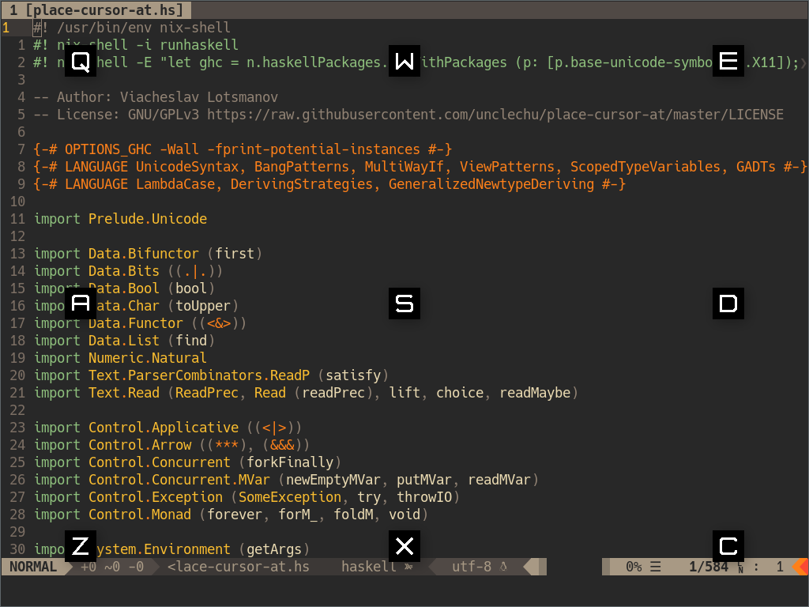

Utility for X11 that helps to move mouse cursor using only keyboard
written in Haskell.

You bind a hotkey (in your WM configuration or by using [xbindkeys]) to run
`place-cursor-at` (say `Super+M`) and when you press it you see 9 windows on
current screen with letters shown on them. When you press a letter on your
keyboard that is associated with one of those windows your mouse cursor appear
at the center of that window and the application closes. Thus you can quickly
move your mouse cursor to one of 9 different spots by two-step combo.

I made it for myself to use with
[xmonad](https://github.com/unclechu/xmonadrc)
and [i3](https://github.com/unclechu/i3rc).



## Requirements

Either one:

1. [Nix Package Manager]

   **WARNING!** You have to provide [Terminus font] in your system setup.
   **FIXME** issue: https://github.com/unclechu/place-cursor-at/issues/1

2. [The Haskell Tool Stack] and:

   1. `libX11` development files
   2. `libXinerama` development files
   3. [Terminus font] available in your system setup

## How to use

### With Nix

See [Nix Package Manager].

You can run this application like this:

``` sh
nix-shell --run place-cursor-at
```

See also [shell.nix]’s arguments for available options.
For instance if you want to enter a `nix-shell` with `cabal` available:

``` sh
nix-shell --arg withCabal true
```

#### NixOS

You can add this application into your NixOS `configuration.nix` like this
(mind that [Terminus font] is provided here too):

``` nix
{ pkgs, ... }:
let
  place-cursor-at-src = pkgs.fetchFromGitHub {
    owner = "unclechu";
    repo = "place-cursor-at";
    rev = "ffffffffffffffffffffffffffffffffffffffff"; # Git commit hash
    sha256 = "0000000000000000000000000000000000000000000000000000";
  };

  place-cursor-at = pkgs.callPackage place-cursor-at-src {};
in
{
  fonts.fonts = [ pkgs.terminus_font ];
  environment.systemPackages = [ place-cursor-at ];
}
```

### With Stack

See [The Haskell Tool Stack].

``` sh
stack build
stack exec place-cursor-at
```

You could install `place-cursor-at` binary to `~/.local/bin` directory
(make sure you have this directory in your `PATH` environment variable):

``` sh
stack install
```

#### NixOS note

If you need to work with Stack under NixOS for whatever reason you would have to
use `--system-ghc` in order to make it work. You can manually add `--system-ghc`
to each call of `stack` or define this alias for your convenience:

``` sh
alias stack='stack --system-ghc'
```

## Using it as script

You also can run this application as a script
(`nix-shell` script, so you have to
[install Nix Package Manager](https://nixos.org/nix/manual/#chap-installation)
first):

``` sh
src/place-cursor-at.hs
```

But this application is intended to be used very often (to be run again and
again many times) and to be very responsive, so it’s better to precompile it to
reduce startup time.

## Xinerama note

By default it appears and do its stuff on display where your mouse cursor is.
But you can specify which display where it should appear on:

``` sh
place-cursor-at 1
```

Or on third display:

``` sh
place-cursor-at 3
```

## Jump to specific position without GUI

You can immediately jump to specific position of a screen without showing any
GUI, like this:

``` sh
place-cursor-at LT
```

It’s case-insensitive, this also would work:

``` sh
place-cursor-at lt
```

And you also can specify a display you want to jump to:

``` sh
place-cursor-at lt 1
```

In any order of the arguments:

``` sh
place-cursor-at 1 lt
```

### Codes of available positions

| Code | Deciphering           |
| -    | -                     |
| `LT` | **L**eft-**T**op      |
| `LC` | **L**eft-**C**enter   |
| `LB` | **L**eft-**B**ottom   |
| `CT` | **C**enter-**T**op    |
| `CC` | **C**enter-**C**enter |
| `CB` | **C**enter-**B**ottom |
| `RT` | **R**ight-**T**op     |
| `RC` | **R**ight-**C**enter  |
| `RB` | **R**ight-**B**ottom  |

## Author

[Viacheslav Lotsmanov](https://github.com/unclechu)

## License

[GNU/GPLv3](LICENSE)

[The Haskell Tool Stack]: https://docs.haskellstack.org/en/stable/README/
[Nix Package Manager]: https://nixos.org/manual/nix/stable/#ch-about-nix
[shell.nix]: shell.nix
[Terminus font]: http://terminus-font.sourceforge.net/
[xbindkeys]: https://linux.die.net/man/1/xbindkeys
