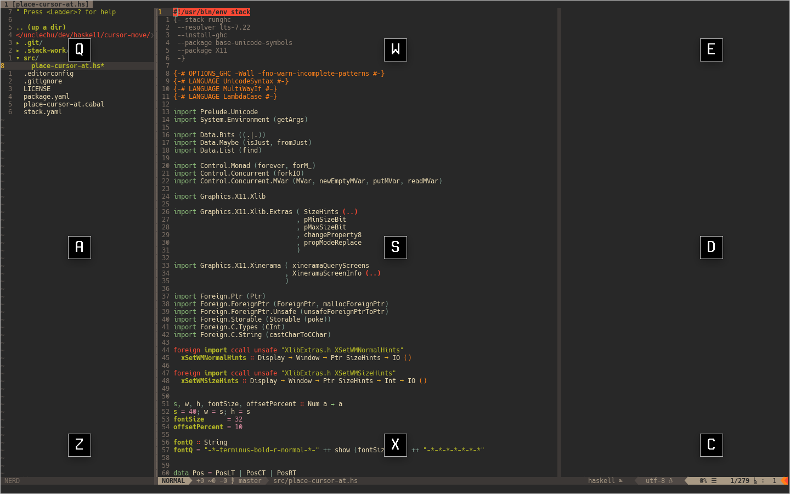

# place-cursor-at

Utility for X11 that helps to move cursor using only keyboard
written in Haskell.

I made it for myself to use with [xmonad](https://github.com/unclechu/xmonadrc).



## Requirements

- [Haskell Tool Stack](https://haskellstack.org/)
- Development files of `libX11`

## How to use

```bash
$ stack build
$ stack exec place-cursor-at
```

You could install `place-cursor-at` binary to `~/.local/bin` directory
(make sure you have this directory in your `PATH` environment variable):

```bash
$ stack install
```

## Using it as script

It could be started as [stack](https://haskellstack.org/)-script:

```bash
$ src/place-cursor-at.hs
```

But it is supposed to be used very often and to be very responsive,
so it's better to precompile it to reduce startup time.

## Xinerama note

By default it appears and do its stuff on display where is your mouse cursor.
But you can specify which display it should appear on:

```bash
$ place-cursor-at 1
```

Or on third diplay:
```bash
$ place-cursor-at 3
```

## Author

[Viacheslav Lotsmanov](https://github.com/unclechu)

## License

[GNU/GPLv3](./LICENSE)
